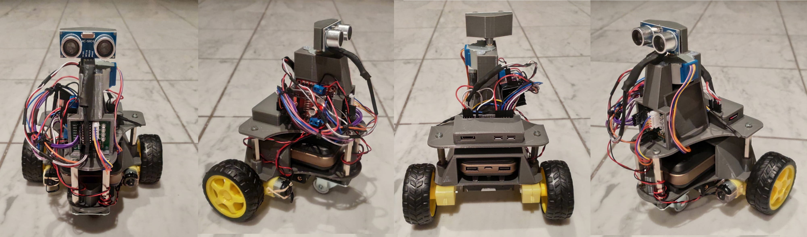
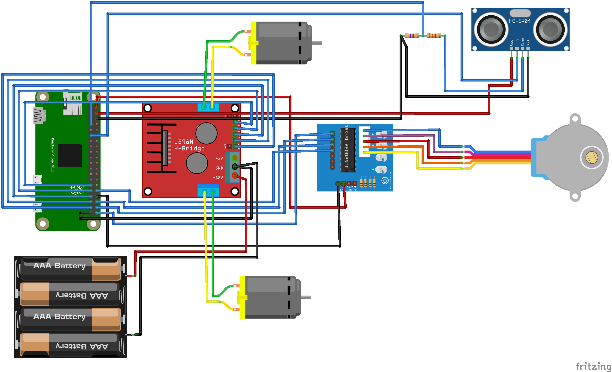

# PiBot
A robot using a Raspberry Pi as main unit. 

## What is it
The goal of PiBot is to be a small robot that can autonomously drive around in the house and maybe in the future to do some more or less useful stuff :D 
The "eyes" of the robot is an ultra sonic sensor, using the usdar software developed under [Github Usdar](https://github.com/vanslipon/usdar).

## Parts used
- [One Raspberry Pi Zero](https://www.amazon.de/Raspberry-Pi-Zero-WH-512/dp/B07C7FHJDX)
- [One Powerbank for Raspberry](https://www.amazon.de/gp/product/B018R0F4YQ)
- [One Front wheel (moving in any direction)](https://www.amazon.de/gp/product/B001HGJ7GY)
- [Two DC motors with tires](https://www.amazon.de/gp/product/B06Y5RMF8Q)
- [Two L298N controller boards](https://www.amazon.de/gp/product/B077YC3JX9)
- [One Battery holder](https://www.amazon.de/gp/product/B077YC3JX9)
- [One ultra sonic sensor](https://www.amazon.de/Elegoo-HC-SR04-Ultraschallmodul-Distanzsensor-MEGA2560/dp/B01M9CMJ9O)
- [One stepper motor with driver board (or servo)](https://www.amazon.de/gp/product/B01IP7IOGQ)

## Circuit Diagram

## 3D Model for the robot
The 3d model of the robot is developed with [Tinkercad](https://www.tinkercad.com/).
The .stl file(s) will be stored in the [stl](stl) folder of this repository.
Simply print them out using any 3d printer and start building your PiBot :)

## Instructions on how to build the robot
- Use circuit diagram to wire everything up 
- Hot glue is your best friend :D
- Good luck

## Instructions on how to use the software
